# Design Document 


Authors: CHRISTIAN DAMIANO CAGNAZZO, MONA DAVARI, FEDERICO RINAUDI, FAYOU ZHU

Date:   23/05/2022


# Contents

- [High level design](#package-diagram)
- [Low level design](#class-diagram)
- [Verification traceability matrix](#verification-traceability-matrix)
- [Verification sequence diagrams](#verification-sequence-diagrams)

# Instructions

# Instructions

The design must satisfy the Official Requirements document, notably functional and non functional requirements, and be consistent with the APIs

# High level design 

```plantuml
card card [
API Layer
----
Application Logic Layer
----
Persistence Layer (DB)
]
```

The structure is divided into three layers: "API LAYER", "LOGIC LAYER" and "DB PERSISTENCE LAYER".
API LAYER:
In this level the APIs are defined.
At this level we wait for the LOGIC LAYER functions and use their return value to build the API response.
LOGIC LAYER:
This level is divided into two parts: "SERVER SECTION" and "DATA SECTION"
SERVER SECTION:
In this section we await the functions of the DB PERSISTENCE LAYER and use their return value to implement the logical part of the application and to respond to the LAYER API.
If we need to update the application logic we only need to update this section.
DATA SECTION:
In this section are managed the conversion of the data from the API LAYER and the PERSISTENCE LAYER formats into the LOGIC LAYER format one and vice versa.
This section is accessible only within the LOGIC LAYER and abstract it from other layers.
The MANAGER LAYER receives "raw" objects and uses the constructors of the classes present in this section to transform them into objects conforming to a certain standard, complete and with all the correct fields.
DB PERSISTENCE LAYER:
In this layer is managed the interaction with the DB, here are written all queries, the insertion and the update of thr DB.


# Low level design

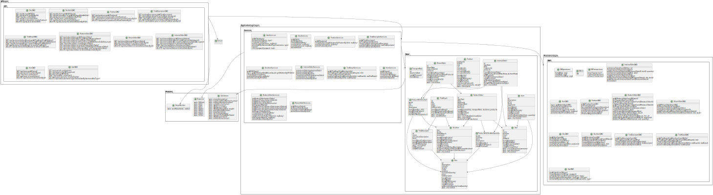

```plantuml
@startuml
scale 0.2

namespace Modules{
  class Response{

    static 200(res)
    static 201()
    static 204()
    static 401()
    static 404(e)
    static 409(e)
    static 422(e)
    static 500(e)
    static 503(e)
}

class ResultBuilder{
    static sendResult(resIn, resOut)
}

class Validation {

    static emptyString(string)
    static negativeOrZeroNumber(number)
    static negativeNumber(number)
    static countDecimal(value)
    static isNotPrice(value)
    static isNotNumericID(id)
    static isNotDigitStringID(id, length)
    static dateIsValidOrNull(date)
    static dateIsValid(date)
    static isInThePast(rawDate)
    static isValidInThePastOrNull(date)
    static isNotBoolean(field)
    static notValidEmail(email)
}
}

namespace APILayer {
namespace API {

class SkuRoute{
GET /api/skus getAllSKU()
GET /api/skus/:id getSKUByID()
POST /api/sku createSKU()
PUT /api/sku/:id modifySKU()
PUT /api/sku/:id/position modifyPosition()
DELETE /api/skus/:id deleteSKU()
}


class SkuItemRoute{
GET /api/skuitems getAllSKUItems()
GET /api/skuitems/sku/:id getAllSKUItemWithASKUId()
GET /ap/skuitems/:rfid getSKUItemByRFID()
POST /api/skuitem createSKUItem()
PUT /api/skuitems/:rfid modifySKUItem()
DELETE /api/skuitems/:rfid deleteSKUItemByRFID()
}


class PositionRoute{
GET /api/positions getAllPositions()
POST /api/position/:positionID createPosition()
PUT /api/position/:positionID/changeID modifyPositionById()
DELETE /api/position/:positionID deletePositionById()
}

class TestDescriptionRoute{
GET /api/testDescriptors getAllTestDescriptor()
GET /api/testDescriptors/:id getTestDescriptorById()
POST /api/testDescriptor createTestDescriptor()
PUT /api/testDescriptor/:id modifyTestDescriptorById()
DELETE /api/testDescriptor/:id deleteTestDescriptorById()
}

class TestResultRoute{
GET /api/skuitems/:rfid/testResults getAllTestResultForASKUItem()
GET /api/skuitems/:rfid/testResults/:id getAllTestResultForASKUItem()
POST /api/skuitems/testResult createTestResultForASKUItem()
PUT /api/skuitems/:rfid/testResult/:id modifyTestResult()
DELETE /api/skuitems/:rfid/testResult/:id deleteTestResult()
}

class RestockOrderRoute{
GET /api/restockOrders getAllRestockOrder()
GET /api/restockOrdersIssued getAllIssuedRestockOrder()
GET /api/restockOrders/:id getRestockOrderById()
GET /api/restockOrders/:id/returnItems getAllSKUItemsToBeReturned()
POST /api/restockOrder createRestockOrder()
PUT /api/restockOrder/:id modifyRestockOrderState()
PUT /api/restockOrder/:id/skuItems addSKUItemsToRestockOrder()
PUT /api/restockOrder/:id/transportNote addTransportationNote()
DELETE /api/restockOrder/:id deleteRestockOrderById()
}

class ReturnOrderRoute{
GET /api/returnOrders getAllReturnOrders()
GET /api/returnOrders/:id getReturnOrderById()
POST /api/returnOrder createReturnOrder()
DELETE /api/returnOrder/:id deleteReturnOrderById()
}

class InternalOrderRoute{
GET /api/internalOrders getAllInternalOrders()
GET /api/internalOrdersIssued() getAllInternalOrdersIssued()
GET /api/internalOrdersAccepted getAllInternalOrdersAccepted()
GET /api/internalOrders/:id getInternalOrderById()
POST /api/internalOrders createInternalOrder()
PUT /api/internalOrders/:id modifyInternalOrderState()
DELETE /api/internalOrders/:id deleteOrderById()
}

class ItemRoute{
GET /api/items getAllItems()
GET /api/items/:id/:supplierId getItemById()
POST /api/item createItem()
PUT /api/item/:id/:supplierId modifyItem()
DELETE /api/items/:id/:supplierId deleteItemById()
}

class UserRoute{
GET /api/userinfo getUserInfo()
GET /api/suppliers getAllSuppliers()
GET /api/users getAllUsers()
POST /api/newUser createUser()
PUT /api/users/:username modifyRights()
DELETE /api/users/:username/:type deleteUserByUsernameAndType()
}

}
}



namespace ApplicationLogicLayer {

namespace Services{
Class UserServices {
    getAllUsers(type)
    getUserInfo(reqBody, type)
    createUser(reqBody)
    modifyType(username, reqBody)
  deleteUserByUsernameAndType(username, type) 
logout()
checkpassword(password, hash)
    
}

Class SkuServices {
    getAllSKU()
    getSKUByID(Id)
    createSKU(reqBody)
    modifySKU(id, reqBody)
    modifyPosition(id, reqBody)
   deleteSKU(id)
}

Class PositionServices {
    getAllPositions()
    createPosition(reqBody)modifyPositionById(id, reqBody)
modifyPositionId(id, reqBody)
deletePositionById(id)
}

Class TestDescriptorServices {
  getAllTestDescriptor()
  getTestDescriptorById(id)
  createTestDescriptor(rawTestDescriptor)
 modifyTestDescriptorById(id, rawTestDescriptor)  
deleteTestDescriptorById(id)
}
Class SkuItemServices {
    getAllSKUItem()
      async getAllSKUItemWithASkuId(skuId) getSKUItemByRFID(rfid)
createSKUItem(reqBody)
modifySKUItem(rfid, reqBody)
deleteSkuItemByRFID(rfid)
}

Class InternalOrderServices {
    getInternalOrder(rawInternalOrder)
getInternalOrders(filter)
getInternalOrderById(id)
createInternalOrder(rawInternalOrder)
modifyState(id, reqBody)
deleteInternalOrderById(id)
}
 
Class TestResultServices {
 getAllTestResultForASkuItem(rfid)
getTestResultForASkuItemById(testResultId, rfid)
createTestResult(rawTestResult)
modifyTestResultForASkuItemById(rfid, testResultId, rawTestResult)
deleteTestResultById(rfid, testResultId)
}

Class ItemServices {
getAllItems()
getItemById(ID, supplier)
createItem(APIBody)
modifyItem(ID, APIBody, supplier)
deleteItemById(ID, supplier)
}


Class RestockOrderServices {
getRestockOrder(restockOrder)
getReturnProduct(restockOrderId)
getAllRestockOrder(issued)
getAllSkuItemsToBeReturned(id)
getTransportNote(id)
getAllSkuItemForRestockOrder(restockOrderId)
getAllProductsForRestockOrder(restockOrderId)
getAllProductsForReturnOrder(restockOrderId)
getRestockOrderById(id)
createRestockOrder(reqBody)
 modifyState(id, reqBody)
addSkuItemsToRestockOrder(id, reqBody)
addTransportNote(id, reqBody)
deleteRestockOrderById(id)    
}



Class ReturnOrderServices {
    getAllReturnOrders()
getReturnOrderById(id)
createReturnOrder(APIBody)
deleteReturnOrderById(id)
}
}

namespace Data {
class InternalOrder{
id
issueDate
state
customerId
products
FromDB(internalOrder)
assignProductsFromDB(skuRows, skuItemRows)
toDBFormat()
FromAPI(rawInternalOrder)
intoAPIFormat()
setNewState(newState)
static checkNewState(newState)
fromAPIPModify(rawInternalOrder)
static checkId(id)
}

class Item {
id
description
price
skuId
supplierId
fromDB(obj)
fromAPI(obj)
fromAPIModify(obj)
intoAPIFormat()
intoDBFormat()
itemForRestockOrder(item, quantity)
itemForReturnOrder(item)
static checkId(id)
}

class Position {


    positionID
    aisleID
    row
    col
    maxWeight
    maxVolume
    occupiedWeight
    occupiedVolume


    fromApi(obj)
    fromDB(obj) 
    fromAPIModify(obj) 
    intoDBFormat() 
    intoAPIFormat() 
    fromId(newPositionID) 
    setOccupation(volume, weight) 
    static checkId(id) 
}
class ProductWithSkuAndQuantity {
  skuId
  quantity
  price
  description


  fromDB(rawSku)
  fromAPI(rawProduct) 
  intoAPIFormat() 
}

class ProductWithSkuItem {
  skuId
  rfid
  price
  description

  fromDB(rawSku, rfid) 
  fromAPI(rawProduct) 
  intoAPIFormat()
  fromAPIPModify(product)
}

class RestockOrder {
    id
    issueDate
    state
    supplierId
    transportNote
    products
    skuItems
    

    intoAPIFormat(obj, transportNote, skuItems, products)
    fromAPI(obj)
    intoDBFormat()
    fromDB(obj)
    static checkNewState(newState)
    static checkId(id)
    skuItemsFromAPI(skuItems)

}

class ReturnOrder {

	id
	returnDate
	restockOrderId
	products

	fromDB(rawReturnOrder)
	assignProductsFromDB(rawProducts)
	fromAPI(rawReturnOrder)
	intoAPIFormat()
	intoAPIFormatWithID()
	intoDBFormat()
	static checkId(id)
}

class Sku {
  id;
  description;
  volume;
  weight;
  notes;
  position;
  availableQuantity;
  price;
  testDescriptor;


  fromAPI(obj)
  fromDB(obj)
  fromAPIModify(obj)
  intoDBFormat()
  intoAPIFormat() 
  setAvailableQuantity(newQuantity)
  static checkId(id)
}

class SkuItem {
  rfid;
  skuId;
  dateOfStock;
  available;


  fromAPI(rawSkuItem)
  fromDB(rawSkuItem)
  fromAPIModify(rawSkuItem)
  fromDB(rawSkuItem)
  intoDBFormat()
  intoAPIFormat()
  intoAPIFormatWithoutAvailable()
  skuItemForRestockOrderIntoAPIFormat(skuItem)
  newSkuItemForRestockOrder(skuItem)
  static checkId(id) 


}

class TestDescriptor {
  id
  name
  procedureDescription
  skuId

  fromDB(rawTestDescriptor)
  fromAPI(rawTestDescriptor)
  fromAPIModify(obj)
  static checkId(id)
  toDBFormat()
  intoAPIFormat()
}

class TestResult {
  id
  rfid
  date
  result
  testDescriptor

  fromDB(rawTestResult)
  FromAPICreate(rawTestResult)
  FromAPIModify(rawTestResult)
  static checkId(id)
  static validRfid(rfid)
}
class TransportNote{
    id
    shipmentDate

    intoAPIFormat()
    fromDB(obj)
    
}

class User {
  id
  name
  surname
  email
  type
  password

  fromDB(rawUser)
  fromAPI(rawUser)
  fromAPILogin(rawUser)
  intoDBFormat()
  intoAPIFormat(filter)
  static checkUsername(username)
  static typeIsValid(type)
  static checkId(id)
}
InternalOrder --> ProductWithSkuItem
InternalOrder --> ProductWithSkuAndQuantity
InternalOrder --> User
Item --> User
Item --> Sku
ProductWithSkuAndQuantity --> Sku
ProductWithSkuItem --> Sku
ProductWithSkuItem --> SkuItem
RestockOrder --> User
RestockOrder --> ProductWithSkuAndQuantity
RestockOrder --> SkuItem
ReturnOrder --> ProductWithSkuItem
ReturnOrder --> RestockOrder
SkuItem --> Sku
TestDescriptor --> Sku
TestResult --> SkuItem
TestResult --> TestDescriptor 
}
ApplicationLogicLayer.Services --> ApplicationLogicLayer.Data
}

namespace PersistenceLayer {

namespace DAO{

class DBOperations{

    fromDB(sql, args)
    intoDB(sql, args)
    deleteFromDB(sql, args)

}

class DBinit{
 DB
}

class DBTransactions{

    beginTransaction()
    commitTransaction()
    rollbackTransaction()

}

class InternalOrderDAO {
  
  getInternalOrdersFromDB(filter, id)
  createInternalOrder(internalOrder)
  addSkuToInternalOrderIntoDB(internalOrderID, skuID, quantity)
  modifyInternalOrderStateIntoDB(id, state)
  deleteInternalOrderByIdIntoDB(id)
  getAllSkuForInternalOrderFromDB(id)
  addSkuItemToInternalOrderIntoDB(internalOrderId, rfid, skuId)
  getAllSkuItemsForInternalOrderFromDB(internalOrderId)
  deleteData()
}

class ItemDAO {

	async getAllItemsFromDB()
        getItemByIdFromDB(itemId, supplier)
	createItemIntoDB(item)
	supplierSellSku(suplierID, skuID)
        modifyItemIntoDB(itemId, newItem, supplier)
	deleteItemByIdFromDB(itemId, supplier)

}

class PositionDAO {

	getAllPositionFromDB()
	getPositionById(id)
	asycreateNewPositionIntoDb(position)
	modifyPositionIntoDB(position, id)
	modifyPositionIDIntoDb(id, position)
        deletePositionByIdIntoDB(id)
	isPositionAssignedIntoDB(id)


}

class RestockOrderDAO {
    getAllRestockOrderFromDB(issued)
    getTransportNoteFromDB(id)
    getAllSkuItemForRestockOrderFromDB(restockOrderId)
    checkTestResult(skuItemId)
    getAllProductsForRestockOrderFromDB(restockOrderId)
    getRestockOrderByIdFromDB(id)
    createNewRestockOrderIntoDb(restockOrder)
    modifyStateIntoDb(id, state)
    addTransportNoteIntoDb(transportNote)
    addTransportNoteToROIntoDb(id, last_id)
    deleteRestockOrderByIdIntoDB(id)
    addSkuItemToRestockOrderIntoDB(skuid, rfid, id)
    getItemBySkuAndSupplierFromDB(skuId, supplierId)
    addItemToARestockOrder(itemId, roId, quantity)
}

class ReturnOrderDAO {
    getAllReturnOrdersFromDB()
    getReturnOrderByIdFromDB(Id)
    createReturnOrderIntoDB(ReturnOrder)
    deleteReturnOrderByIdFromDB(returnOrderID)
    getAllProductsForAReturnOrderFromDB(returnOrderId)
    addSkuItemToReturnOrderIntoDB(returnOrderId, rfid, skuId)
}

class SkuDAO {
  getAllSkuFromDB()
  getSKUByIDFromDB(Id)
  createNewSkuIntoDB(Sku)
  modifySkuIntoDB(sku, id)
  modifySkuPositionIntoDB(id, positionId)
  deleteSkuByIdIntoDB(id)
}

class SkuItemDAO {

	getAllSkuItemFromDB()
	getAllSkuItemWithASkuIdFromDB(skuId)
	getSKUItemByRFIDFromDB(rfid)
	createSKUItemIntoDB(skuItem)
	modifySKUItemIntoDB(skuItem, rfid)
	deleteSKUItemByRFIDIntoDB(rfid)
}


class TestDescriptorDAO {
  getAllTestDescriptorFromDB()
  getTestDescriptorByIdFromDB(id)
  createTestDescriptorIntoDB(testDescriptor)
  modifyTestDescriptorByIdIntoDB(id, testDescriptor)
  deleteTestDescriptorByIdIntoDB(id)
}

class TestResultDAO {
  
  getAllTestResultForASkuItemFromDB(rfid)
  getTestResultForASkuItemByIdFromDB(testResultId, rfid)
  createTestResultIntoDB(testResult)
  modifyTestResultForASkuItemByIdIntoDB(rfid, testResultId, testResult)
  deleteTestResultByIdIntoDB(rfid, testResultId)
}

class UserDAO {

	getAllUsersFromDB(type)
	createNewUserIntoDb(user, password)
	getUserByUsernameAndType(username, type)
	modifyTypeIntoDb(username, newType, oldType)
	deleteUserByUsernameAndTypeIntoDB(username, type)

}

}
}

class Server{

}

APILayer --> ApplicationLogicLayer.Services
ApplicationLogicLayer.Services --> PersistenceLayer
ApplicationLogicLayer.Data --> Modules.Validation 
ApplicationLogicLayer.Services  -->  Modules.Response  
APILayer --> Modules.ResultBuilder 
APILayer --> Server

@enduml


```


# Verification traceability matrix

| | Modules | API | DBPersistence | UserManager| User | SKUManager|SKU | PositionManager |Position | TestDescriptorManager |Test Descriptor| SKUItemManager|SKUItem | InternalOrderManager|Internal Order | TestResultManager |Test Result| ItemManager |Item | RestockOrderManager|Restock Order | ReturnOrderManager |Return Order|
| ------------- |:--:|:--:|:--:|:--:|:--:|:--:|:--:|:--:|:--:|:--:|:--:|:--:|:--:|:--:|:--:|:--:|:--:|:--:|:--:|:--:|:--:|:--:|:--:|
| FR1 |X|X|X|X|X||||||||||||||||||| 
| FR2 |X|X|X|||X|X|||||||||||||||||  
| FR3 |X|X|X|||||X|X|X|X|||||||||||||  
| FR4 |X|X|X|X|X||||||||||||||||||| 
| FR5 |X|X|X|||||||||X|X|||X|X|||X|X|X|X| 
| FR6 |X|X|X|||||||||||X|X||||||||| 
| FR7 |X|X|X|||||||||||||||X|X|||||


# Verification sequence diagrams 

Each time an API is called, it verifies that the user calling the API has the necessary rights.
Since this happens for each API, the sequence will be reported only once, but this procedure will occur at each call.

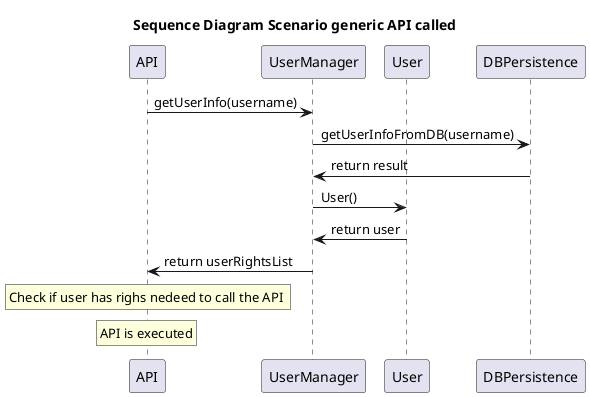

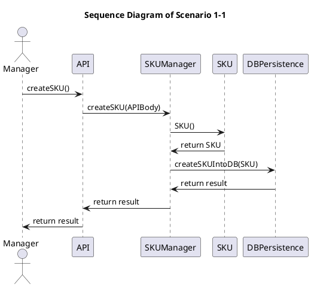

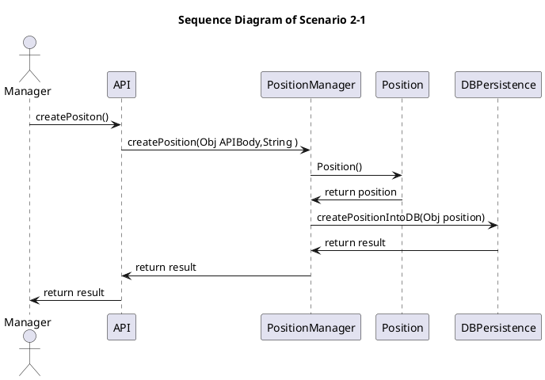

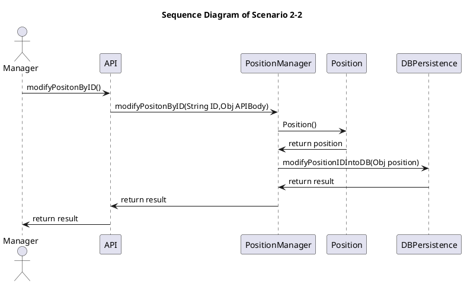

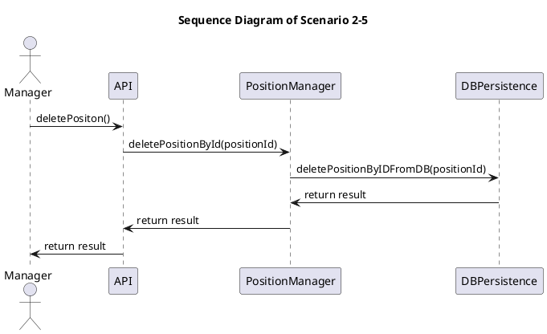


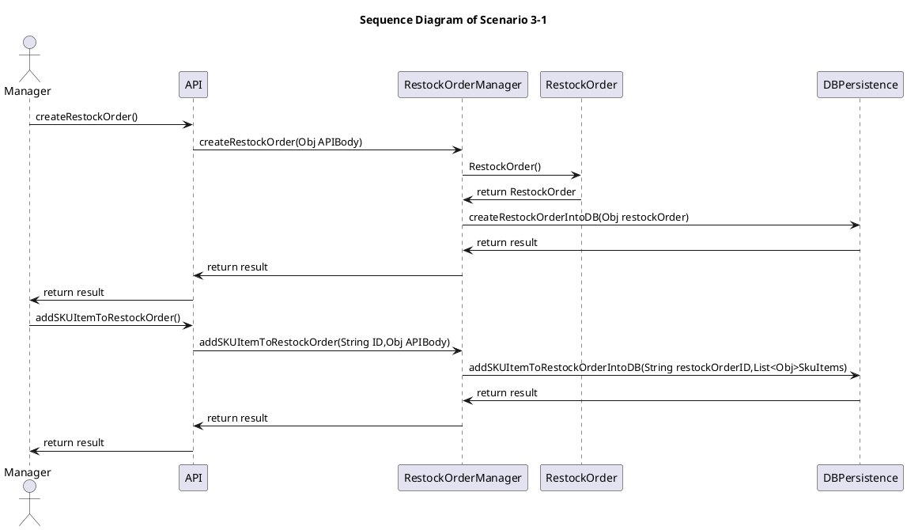

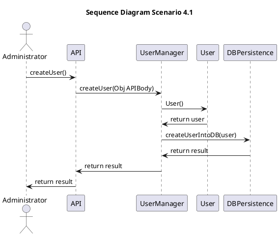

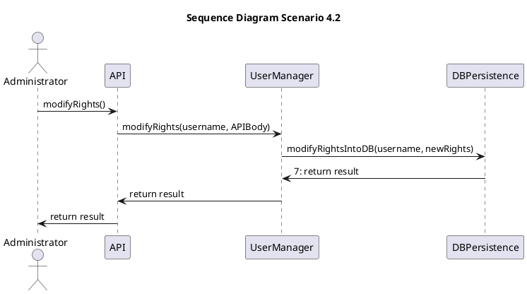

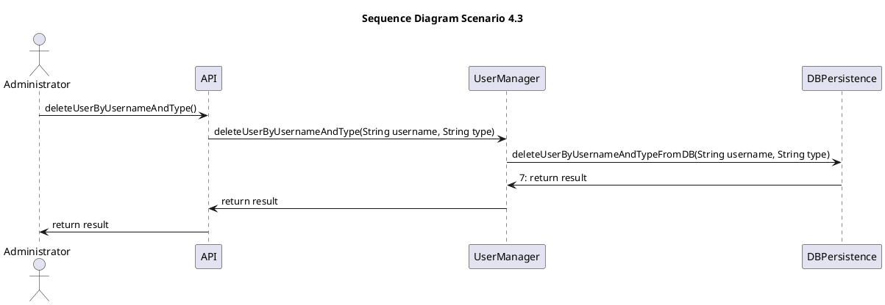

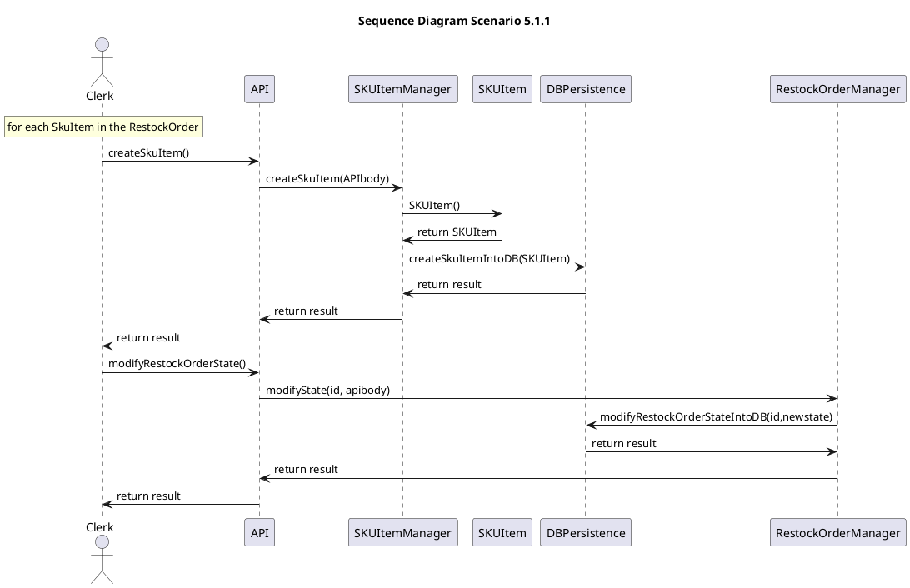

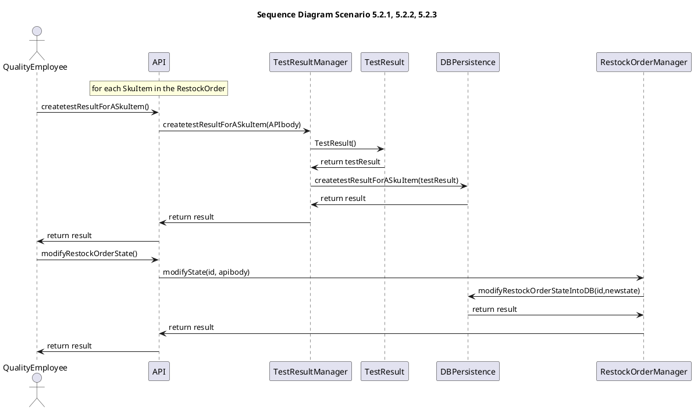

```plantuml
title "Sequence Diagram Scenario 6.1, 6.2"
actor Manager as M
participant API
participant RestockOrderManager
participant ReturnOrderManager
participant SKUManager
participant SKUItemManager
participant PositionManager
participant DBPersistence

M->API: getAllSKUItemsToBeReturned() 
API->RestockOrderManager: getAllSKUItemsToBeReturned(id) 
RestockOrderManager->DBPersistence: getAllSKUItemsToBeReturned(id)
DBPersistence-> RestockOrderManager: return result
RestockOrderManager->API: return result
API->M: return result

M->API: createReturnOrder()
API->ReturnOrderManager: createReturnOrder(apiBody)
ReturnOrderManager->ReturnOrder: ReturnOrder()
ReturnOrder-> ReturnOrderManager: return returnOrder
ReturnOrderManager->DBPersistence: createReturnOrderIntoDB(returnOrder)
DBPersistence->ReturnOrderManager: return result
ReturnOrderManager->API: return result

rnote over API 
for each SkuItem 
endrnote

API->SKUItemManager: modifySKUItem(id, apiBody)
SKUItemManager->DBPersistence: modifySKUItemIntoDB(id, newSkuItem)
DBPersistence->SKUItemManager: return result
SKUItemManager->API: return result

rnote over API 
Only in scenario 6.2
endrnote

API->SKUManager: modifySKU(id, apiBody)
SKUManager->DBPersistence: modifySKUIntoDB(id, newSku)
DBPersistence->SKUManager: return result
SKUManager->API: return result

API->PositionManager: modifyPositionByID(id, apiBody)
PositionManager->DBPersistence: modifyPositionByIDIntoDB(id, newPosition)
DBPersistence-> PositionManager: return result
PositionManager->API: return result

API->M: return result 
@enduml

```

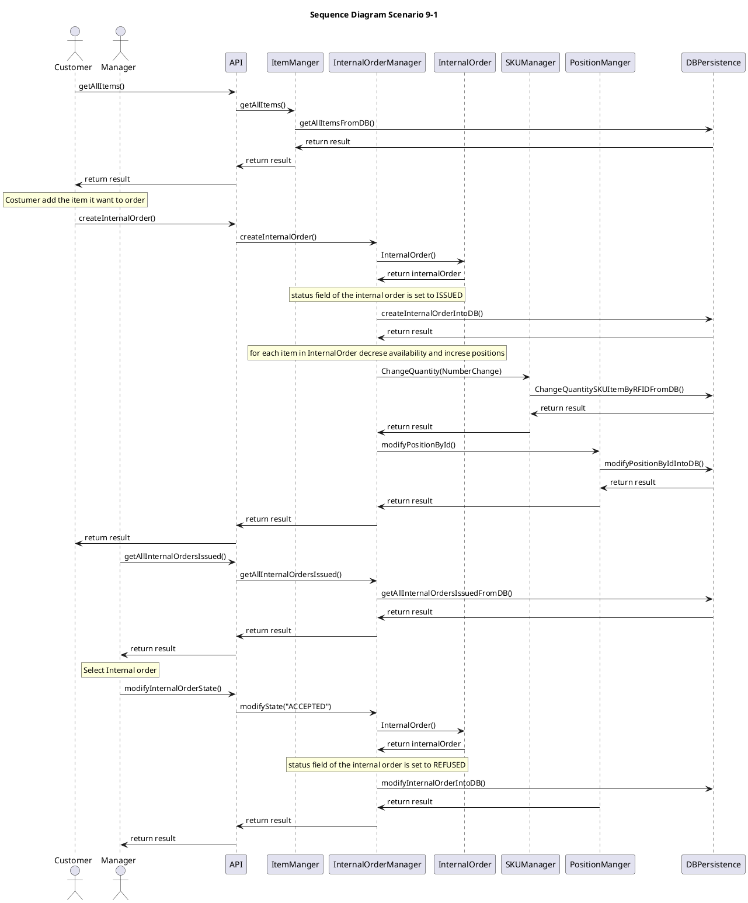

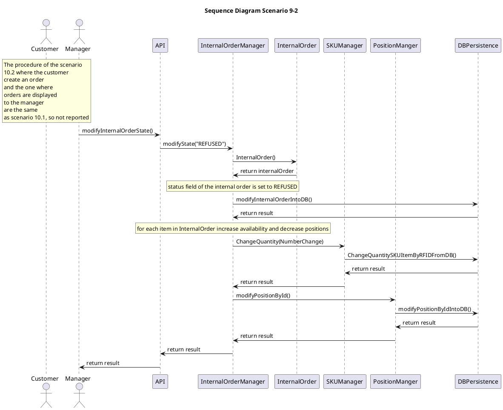

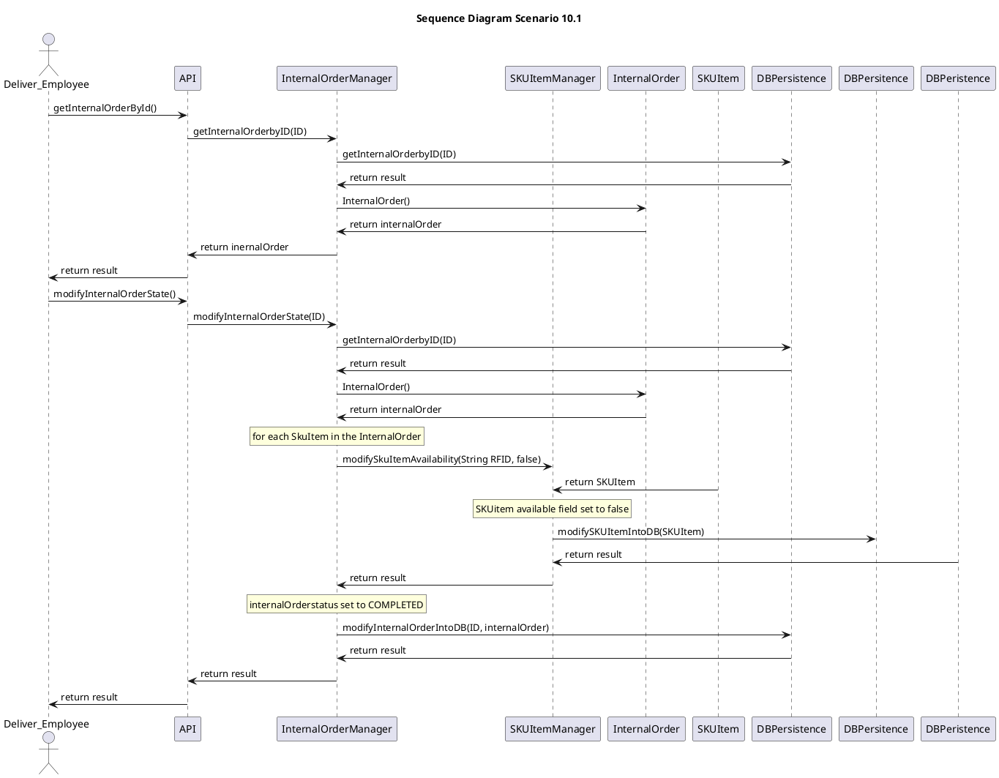

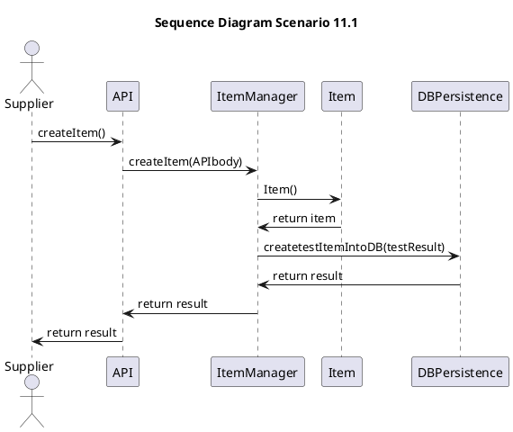

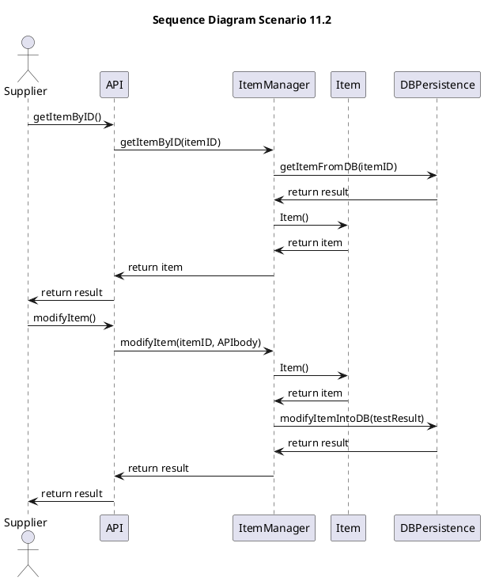

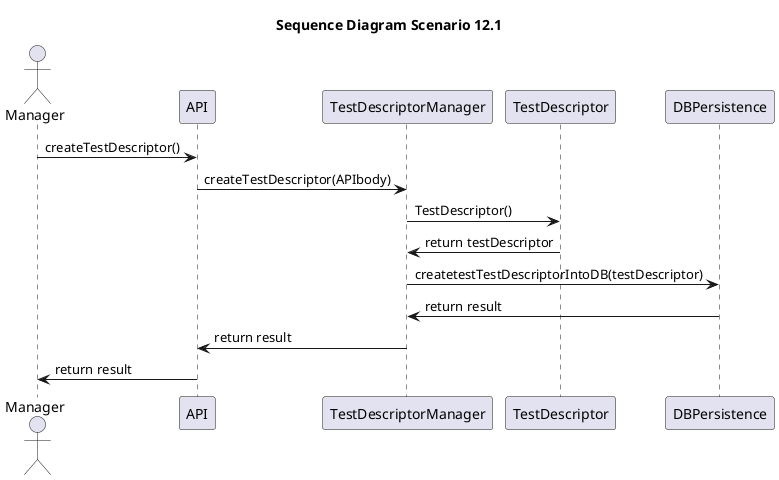

```plantuml
title "Sequence Diagram Scenario 12.2"
actor Manager as M
participant API
participant TestDescriptorManager
participant TestDescriptor
participant DBPersistence


M->API: getTestDescriptorByID() 
API-> TestDescriptorManager: getTestDescriptorByID(testDescriptorID)
TestDescriptorManager -> DBPersistence: getTestDescriptorFromDB(testDescriptorID)
DBPersistence -> TestDescriptorManager: return result
TestDescriptorManager->TestDescriptor: TestDescriptor() 
TestDescriptor -> TestDescriptorManager: return testDescriptor
TestDescriptorManager-> API: return TestDescriptor
API -> M: return result
M->API: modifyTestDescriptorByID() 
API-> TestDescriptorManager: modifyTestDescriptorByID(testDescriptorID, APIbody)
TestDescriptorManager->TestDescriptor: TestDescriptor() 
TestDescriptor -> TestDescriptorManager: return testDescriptor
TestDescriptorManager->DBPersistence: modifyTestDescriptorByIDIntoDB(testDescriptorID, testDescriptor)
DBPersistence-> TestDescriptorManager: return result
TestDescriptorManager-> API: return result
API -> M: return result
@enduml

```

```plantuml
@startuml
title "Sequence Diagram Scenario 12.3"
actor Manager as M
participant API
participant TestDescriptorManager
participant TestDescriptor
participant DBPersistence


M->API: getTestDescriptorByID() 
API-> TestDescriptorManager: getTestDescriptorByID(testDescriptorID)
TestDescriptorManager -> DBPersistence: getTestDescriptorFromDB(testDescriptorID)
DBPersistence -> TestDescriptorManager: return result
TestDescriptorManager->TestDescriptor: TestDescriptor() 
TestDescriptor -> TestDescriptorManager: return testDescriptor
TestDescriptorManager-> API: return TestDescriptor
API -> M: return result
M->API: deleteTestDescriptorByID() 
API-> TestDescriptorManager: deleteTestDescriptorByID(testDescriptorID)
TestDescriptorManager->DBPersistence: deleteTestDescriptorByIDIntoDB(testDescriptorID)
DBPersistence-> TestDescriptorManager: return result
TestDescriptorManager-> API: return result
API -> M: return result
@enduml

```

