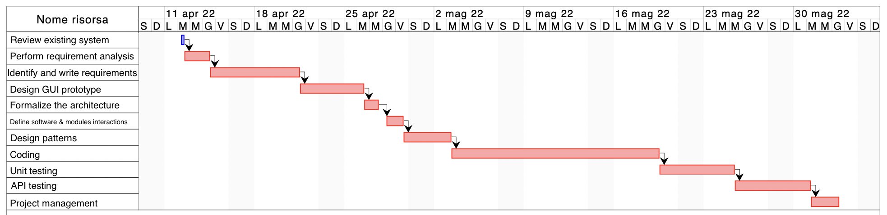

# Project Estimation  
Date: 13/04/2022

Version: 2

# Estimation approach
Consider the EZWH  project as described in YOUR requirement document, assume that you are going to develop the project INDEPENDENT of the deadlines of the course
# Estimate by size
### 
|             | Estimate                        |             
| ----------- | ------------------------------- |  
| NC =  Estimated number of classes to be developed   |               35               |             
|  A = Estimated average size per class, in LOC       |                100            | 
| S = Estimated size of project, in LOC (= NC * A) | 3500 |
| E = Estimated effort, in person hours (here use productivity 10 LOC per person hour)  |               350                       |   
| C = Estimated cost, in euro (here use 1 person hour cost = 30 euro) | 10500 | 
| Estimated calendar time, in calendar weeks (Assume team of 4 people, 8 hours per day, 5 days per week ) |       2.5 weeks             |               

# Estimate by product decomposition
### 
|         component name    | Estimated effort (person hours)   |             
| ----------- | ------------------------------- | 
|requirement document    | 70 |
| GUI prototype |35|
|design document |40|
|code |100|
| unit tests |30|
| api tests |30|
| management documents  |20|

# Estimate by activity decomposition
### 
| Activity name             | Sub-activity name          | Estimated effort (person hours) |           
| ------------------------- | -------------------------- | ------------------------------- |
| Requirements activties              |                            |           85                      |
|                           | Review existing systems    | 5                               |
|                           | Perform requirement analysis      | 15                       |
|                           | Identify and write requirements        | 40                  |
|                           | Designe GUI propotype  | 25                                  |
| Design activities                  |                           |          35                        |
|                           | Formalize the architecture | 10                              |
|                           | Define software modules & interactions | 15                  |
|                           | Design patterns               | 10                           |
| Implementation activities            |                           |      160                            |
|                           | Coding                    | 100                              |
|                           | Unit testing              | 30                               |
|                           | API testing               | 30                               |
| Integration activities             |                           |           20                       |
|                           | Project Management  |        20                              |

###

# Summary

Report here the results of the three estimation approaches. The  estimates may differ. Discuss here the possible reasons for the difference

|                                       | Estimated effort                        |   Estimated duration |          
| ------------------------------------- | --------------------------------------- | -------------------- |
| estimate by size                      | 350 ph                                  | 2.5 weeks   |
| estimate by product decomposition     | 325 ph                                  | 2.2 weeks   |
| estimate by activity decomposition    | 300 ph                                  | 2 weeks   |

The differences could derive from the fact that the first two methods are less precise, while in the third a more specific estimate is made based on the activity to be done, and not on the product to be obtained as in the second way or on the size as in the first

