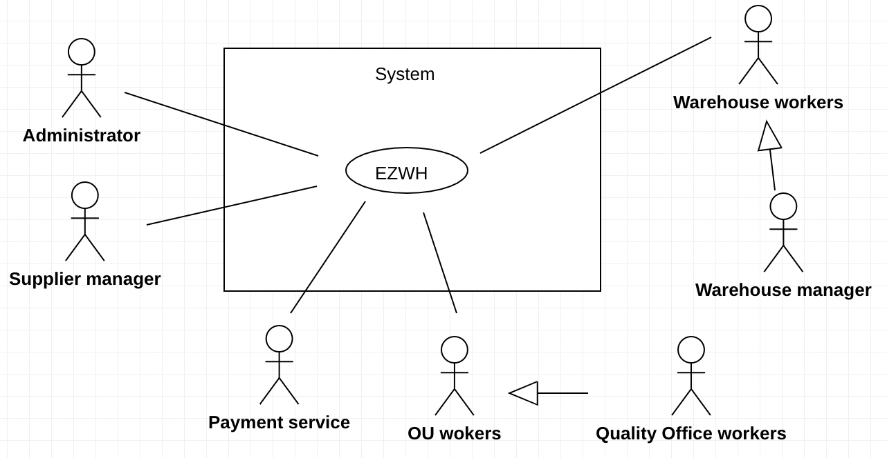
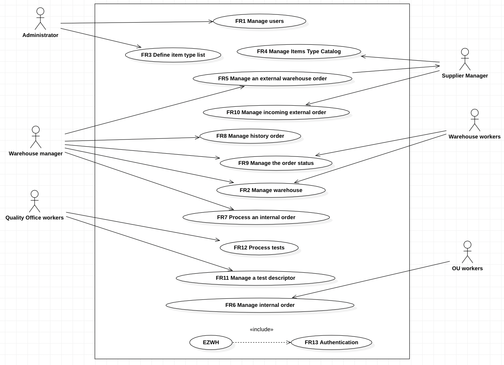
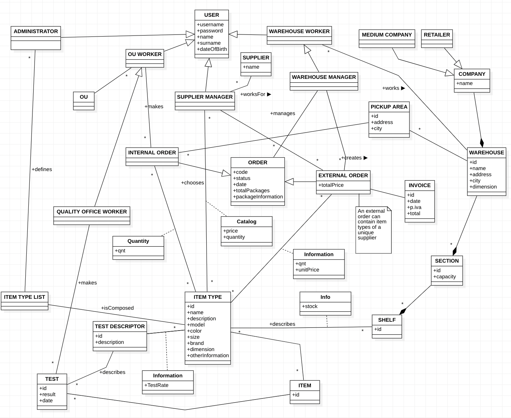
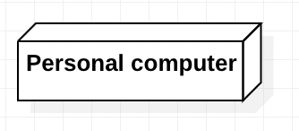
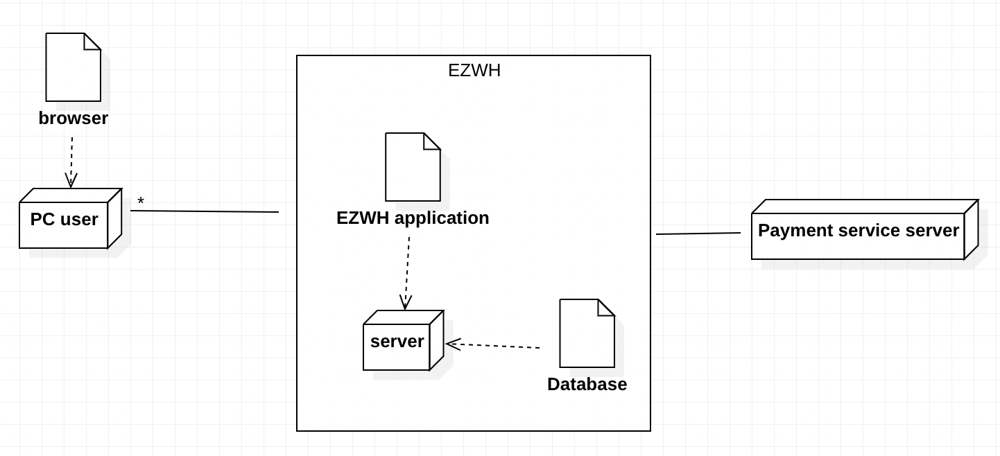

#Requirements Document 

Date: 13/04/2022

Version: 4.1

# Contents

- [Informal description](#informal-description)
- [Stakeholders](#stakeholders)
- [Context Diagram and interfaces](#context-diagram-and-interfaces)
	+ [Context Diagram](#context-diagram)
	+ [Interfaces](#interfaces) 
	
- [Stories and personas](#stories-and-personas)
- [Functional and non functional requirements](#functional-and-non-functional-requirements)
	+ [Functional Requirements](#functional-requirements)
	+ [Non functional requirements](#non-functional-requirements)
- [Use case diagram and use cases](#use-case-diagram-and-use-cases)
	+ [Use case diagram](#use-case-diagram)
	+ [Use cases](#use-cases)
    	+ [Relevant scenarios](#relevant-scenarios)
- [Glossary](#glossary)
- [System design](#system-design)
- [Deployment diagram](#deployment-diagram)

# Informal description
Medium companies and retailers need a simple application to manage the relationship with suppliers and the inventory of physical items stocked in a physical warehouse. 
The warehouse is supervised by a manager, who supervises the availability of items. When a certain item is in short supply, the manager issues an order to a supplier. In general the same item can be purchased by many suppliers. The warehouse keeps a list of possible suppliers per item. 

After some time the items ordered to a supplier are received. The items must be quality checked and stored in specific positions in the warehouse. The quality check is performed by specific roles (quality office), who apply specific tests for item (different items are tested differently). Possibly the tests are not made at all, or made randomly on some of the items received. If an item does not pass a quality test it may be rejected and sent back to the supplier. 

Storage of items in the warehouse must take into account the availability of physical space in the warehouse. Further the position of items must be traced to guide later recollection of them.

The warehouse is part of a company. Other organizational units (OU) of the company may ask for items in the warehouse. This is implemented via internal orders, received by the warehouse. Upon reception of an internal order the warehouse must collect the requested item(s), prepare them and deliver them to a pick up area. When the item is collected by the other OU the internal order is completed. 

EZWH (EaSy WareHouse) is a software application to support the management of a warehouse.

# Stakeholders

| Stakeholder name  | Description | 
| ----------------- |:-----------:|
| Suppliers | Receive and prepare the order | 
| Supplier manager | Who manages incoming orders for the suppliers |
| Companies | Medium companies and retailers that have warehouses |
| Warehouse Manager | Who supervises the availability of items and place orders |
| Warehouse Workers | Who work in the warehouse and in charge of tracing each item…..|
| Competitors | Companies that develop similar software to EZWhrehouse |
| Administrator | Manage the application information and define different roles of access to the system |
| Couriers | Who deals with the delivery of orders |
| Quality Office | Organizational Unit |
| Quality Office Workers | Apply quality check on products |
| OU | Different offices of the company |
| OU workers | Place an internal order to the warehouse |
| Delivery person | Who delivery an internal order to the pick-up area |
| Payment service | External service to make a payment |

# Context Diagram and interfaces

## Context Diagram

## Interfaces

| Actor | Logical Interface | Physical Interface  |
| ------------- |:-------------:| -----:|
|  Administrator | GUI, command line interface | Screen, keyboard  |
|  Supplier manager | GUI | Screen, keyboard |
|  Warehouse manager | GUI | Screen, keyboard |
|  Warehouse workers | GUI | Screen, keyboard |
| OU workers  | GUI | Screen, keyboard | 
| Quality office workers | GUI | Screen, keyboard | 
| Payment service | Internet connection | API |

# Stories and personas

Rachel Green is 42, works full-time in a supplier company. She has a relevant diploma and relevant working experiences, but she is not familiar with IT technology, so her job is mainly to create her company catalog by inserting it from keyboard.

Chandler Bing is 20 and he is a part-time warehouse worker. He is a college student majoring in market analysis and loves social media, he is proficient in all kinds of software. As a new employee he has to get familiar with the warehouse INFO system as soon as possible, including entering new information of new items into the system, tracing and recording the position of each item in the warehouse (by inserting them into the system).

Monica Geller is 37, she is a warehouse manager, and she is a capable worker, She knows the application system very well, so she is in charge of checking the availability of each item type, and deciding whether an order for this item type is required based on its availability. She also manages finances and makes payments.

Phoebe Buffay is 32, works in a quality office, she has a master degree. She will be notified when a quality check is needed to be performed. She will obtain every detail of the tests that should be done on order items in the application, so that she can check the quality of the arrival products, then decides whether it is necessary to request the return of the bad quality items.

Joey Tribbiani is 28, works in an organizational unit (OU), he knows the ordering system very well, he is responsible for creating the internal order to the warehouse. He often drives to meet customers, so he can stop by and collect the internal order at the pick-up area on the way to meet his customers, after picking up the order, he will complete the order in the application.

Ross is 29, he is an administrator of the application, he has a computer science bachelor degree and works full time. He is able to give access to different users, define different roles, make sure the system is working smoothly, update and maintain the system, and instruct users how to use the application and also provide technical support to them.

# Functional and non functional requirements

## Functional Requirements

| ID        | Description  |
| ------------- |:-------------:| 
|  FR1     | Manage users |
|  FR1.1     | Define a new user |
|  FR1.2     | Modify an existing user |
|  FR1.3     | Deactivate a user |
|  FR1.4     | List all users |
|  FR1.5     | Define roles |
|  FR1.6     | Modify roles |
|  FR1.7     | Search user |
|  FR2         | Manage item types in warehouse |
|  FR2.1      | Check the availability of items type|
|  FR2.2      | Modify the available quantity for an item type|
|  FR2.3      | Show position for an item type|
|  FR2.4      | Modify position for an item type|
|  FR3      |  Define Item type list|
|  FR3.1      |  Create a new Item type|
|  FR3.2      |  Modify an Item type|
|  FR3.3      |  Delete an Item type|
|  FR4         | Manage Items Type Catalog |
|  FR4.1      |  Add an item type to catalog|
|  FR4.2      |  Delete an item type from catalog|
|  FR4.3      |  Edit quantity of an item type in the catalog |
|  FR4.4      |  Edit price of an item type in the catalog |
|  FR5         |  Manage an external order |
|  FR5.1      |   Create an external order |
|  FR5.2      |   Pay an order |
|  FR5.3      |   Add an item type to an external order from the suppliers catalog|
|  FR5.4      |   Delete an item type from an external order|
|  FR5.5      |   Modify quantity of an item type in an external order|
| FR6	       | Manage an internal order |
| FR6.1		   | Create an internal order |
| FR6.2       | Add an item type to an internal order from the list of item type available in the warehouse |
|  FR6.3      |   Delete an item type from an internal order |
|  FR6.4      |   Modify quantity of an item type in an internal order|
| FR6.5       | Select one of the warehouse's pick up area |
| FR7		| Process an internal order |
| FR7.1		| Approve an intern order |
| FR7.2		| Deny an intern order |
|  FR8         |  Manage history order |
|  FR8.1      |  Search an order |
|  FR8.2      |  Delete an order from the history|
|  FR8.3      |  Filter (external, internal, all) order in the history|
| FR9 | Manage order status |
| FR10 | Manage an incoming external order |
|  FR11       | Manage a test descriptor |
|  FR11.1      | Define a new test descriptor|
|  FR11.2      | Assign a test descriptor to an item type |
|  FR11.3      | Show tests for a specific item type |
|  FR11.4      | Edit a test descriptor |
|  FR11.5      | Delete a test descriptor |
|  FR11         |  Process tests |
| FR12.1 | Show the tests to be applied  |
| FR12.2 | Log test results |
| FR12.3 | Accept or reject items |
|  FR13         | Authenticate|
|  FR13.1      | Login|
|  FR13.2      | Logout|

### Access right, actor vs function

| Function | Warehouse Manager | Warehouse workers | Supplier Manager | Quality office workers | OU workers |
| ------------- |--|--|--|--|--|
| FR2 | yes | yes | no | no | no |
| FR4 | no | no | yes | no | no |
| FR5 | yes | no | no | no | no |
| FR6 | no | no | no | no | yes |
| FR7 | yes | no | no | no | no |
| FR8 | yes | no | no | no | no |
| FR9 | yes | yes | no | no | no |
| FR10 | no | no | yes | no | no |
| FR11 | no | no | no | yes | no |
| FR12 | no | no | no | yes | no |

## Non Functional Requirements

| ID        | Type (efficiency, reliability, ..)           | Description  | Refers to |
| ------------- |:-------------:| :-----:| -----:|
|  NFR1     | Usability  |  Application should be used with at most 2 hour training for the users  | All FR | 
|  NFR2     | Availability | The system should be online in working hours |  All FR |
|  NFR3     | Security | The information stored in the system and the different sections should be seen only by specific roles  | All FR |
| NFR4     |   Performance| All functions should complete in < 0.5 sec   | All FR | 
|  NFR5     | Portability | The application should be accessed from all browsers |All FR |

# Use case diagram and use cases

## Use case diagram

### Use case 1, UC1 - Manage users
| Actors Involved        |  Administrator A |
| ------------- |:-------------:| 
|  Precondition     | A exists and is logged in |
|  Post condition     | User U information updated |
|  Nominal Scenario     | A create U and give him a role |
|  Variants     | A deactivates U, A modifies U  role |

##### Scenario 1.1 

| Scenario 1.1 | Create user and define role |
| ------------- |:-------------:| 
|  Precondition     | A exists and is logged in |
|  Post condition     | New account AC with a role created|
| Step#        | Description  |
|  1     | A create a new user AC |
| 2      | A insert AC’s informations |
| 3      | A generates a new username and password for AC |
|  2     | A select AC’s role |
|  3     | A confirms |

##### Scenario 1.2

| Scenario 1.2 | Deactivate user |
| ------------- |:-------------:| 
|  Precondition     | A exists and is logged in |
|               |Account AC exists and is active |
|  Post condition     | AC is deactivate |
| Step#        | Description  |
|  1     | A search AC |  
|  2     | A deactivates AC |
|  3     | A confirms |

##### Scenario 1.3
| Scenario 1.3 | Modify user’s role|
| ------------- |:-------------:| 
|  Precondition     | A exists and is logged in |
|                     | Account AC exists and is active |
|  Post condition     | AC’s role updated|
| Step#        | Description  |
|  1     | A search AC |  
|  2     | A change AC’s role |
|  3     | A confirms |

### Use case 2, UC2 - Manage item types in warehouse 
| Actors Involved        | Warehouse Worker WW, Warehouse Manager WM|
| ------------- |:-------------:| 
|  Precondition     | WW or WM  exists and is logged in |
|  Post condition     | Warehouse’s information updated |
|  Nominal Scenario     | Add a certain quantity of an item type to a shelf |
|  Variants       	| Remove an item type from a shelf|
| | Update position of an item type | 
| | Update item type quantity in a shelf |

##### Scenario 2.1
| Scenario 2.1 | Add a certain quantity of an item type to a shelf |
| ------------- |:-------------:| 
|  Precondition     | WW or WM is logged in|
|  Post condition     | A new item type IT is added in the warehouse|
| Step#        | Description  |
|1 | WM or WW select an item type|
|2 | WM or WW insert the sector and the shelf |
|3 | WM or WW insert the quantity |

##### Scenario 2.2
| Scenario 2.2 | Remove an item type from a shelf |
| ------------- |:-------------:| 
|  Precondition     | WW or WM is logged in, Item type I is stored in a shelf S |
|  Post condition     | I is not stored in S |
| Step#        | Description |
|1 | WM or WW search I or S |
|2 | WM or WW remove the information that indicates that I is stored in S |
|3 | WM or WW confirm |

##### Scenario 2.3
| Scenario 2.3 | Update quantity of an item type in a shelf |
| ------------- |:-------------:| 
|  Precondition     | WW or WM is logged in, Item type I is stored in a shelf S |
|  Post condition     | I quantity in S is updated |
| Step#        | Description |
|1 | WM or WW search I or S |
|2 | WM or WW modify the quantity of I in S |
|3 | WM or WW confirm |

##### Scenario 2.4
| Scenario 2.4 | Update position of an item type|
| ------------- |:-------------:| 
|  Precondition     | WW or WM is logged in, Item type I is stored in a shelf S |
|  Post condition     | I position is updated |
| Step#        | Description |
|1 | WM or WW search I or S |
|2 | WM or WW modify the shelf and the sector of I |

### Use case 3, UC3 - Define item type list 
| Actors Involved        | Administrator A|
| ------------- |:-------------:| 
|  Precondition     | A exists and is logged in |
|  Post condition     | Item type list updated |
|  Nominal Scenario     | A insert a new item type |
|  Variants       	| A remove an item type from the list|
| |A edit an item type in the list |
 
##### Scenario 3.1

| Scenario 3.1 | Add a new item type |
| ------------- |:-------------:| 
|  Precondition     | A exists and is logged in |
|  Post condition     | Item type I is added in the list of item type |
| Step#        | Description  |
|1 |  A defines I|
|2 |  A inserts information of I |
|3 |  A confirm and adds I to the list |

##### Scenario 3.2

| Scenario 3.2 | Remove an item type |
| ------------- |:-------------:| 
|  Precondition     | A exists and is logged in, Item type I exists in the list |
|  Post condition     | Item type I is removed from the list of item type |
| Step#        | Description  |
|1 |  A select I |
|2 |  A remove I from the list |
|3 |  A confirm |

##### Scenario 3.3

| Scenario 3.3 | Edit an item type |
| ------------- |:-------------:| 
|  Precondition     | A exists and is logged in, Item type I exists in the list |
|  Post condition     | I’s information updated |
| Step#        | Description  |
|1 |  A search and select I |
|2 |  A edit the information of I |
|3 |  A confirm |

### Use case 4, UC4 - Manage Item Types Catalog 
| Actors Involved        | Supplier Manager SM |
| ------------- |:-------------:| 
|  Precondition     | SM exists and is logged in |
|  Post condition     | Catalog is updated |
|  Nominal Scenario     | Add a new item type in the catalog |
|  Variants     | Update quantity for an item type in the catalog|
|| Update price for an item type in the catalog|
|| Delete an item type from the catalog |

##### Scenario 4.1

| Scenario 4.1 | Add a new item type to catalog |
| ------------- |:-------------:| 
|  Precondition     | SM exists and is logged in |
|                           |Item type I exists |
|  Post condition     | New item type I is added in the catalog |
| Step#        | Description  |
|  1    | SM select an item type I |  
|  2    | SM inserts a certain quantity of I |
|  3   | SM insert a price for I |
|  4   | SM add I to the catalog |

##### Scenario 4.2

| Scenario 4.2 | Update price for an item type in the catalog |
| ------------- |:-------------:| 
|  Precondition     | SM exists and is logged in | 
|                           |Item Type I exists |
|  Post condition     | I price is updated |
| Step#        | Description  |
|  1     | SM select I |  
|  2     | SM changes I’s price |
 
##### Scenario 4.3

| Scenario 4.3 | Update quantity for an item type in the catalog |
| ------------- |:-------------:| 
|  Precondition     | SM exists and is logged in |
|                           |Item Type I exists |
|  Post condition     | I quantity is updated |
| Step#        | Description  |
|  1     | SM select I |  
|  2     | SM changes I’s quantity |

##### Scenario 4.4

| Scenario 4.4 | Delete an item type from the catalog |
| ------------- |:-------------:| 
|  Precondition     | SM exists and is logged in |
|                           |Item Type I exists |
|  Post condition     | I it is not in the catalog |
| Step#        | Description  |
|  1     | SM select I |  
|  2     | SM remove I |
|  3     | SM confirm |

### Use case 5, UC5 – Manage an external warehouse order
| Actors Involved        |Warehouse manager WM|
| ------------- |:-------------:| 
|  Precondition     | Warehouse manager WM exists and is logged in |
|  Post condition     | New order O exists or it is update|
|  Nominal Scenario     | WM create a new order |
|  Variants   | Add an item type to an order |
|                  | Remove an item type to an order |
|	       | Send order to a supplier |

#### Scenario 5.1
| Scenario 5.1 | Create a new order |
| ------------- |:-------------:| 
|  Precondition     | WM exists and is logged in |
|  Post condition     | A new order O is created |
| Step#        | Description  |
| 1 | WM select an item type and the quantity to buy |
| 2 | The system show a list of suppliers who sell the item type |
| 3 | WM select a supplier from the list of supplier that sell that item type |
| 4 | WM add the item type to O |
| 5| WM saves the order |

#### Scenario 5.2
| Scenario 5.2 | Send a order |
| ------------- |:-------------:| 
|  Precondition     | WM exists and is logged in, order O is sent |
|  Post condition     | O is sent |
| Step#        | Description  |
| 1 | WM choose to pay the order |
| 2 | WM is redirected to the external payment service 

#### Scenario 5.3
| Scenario 5.3 | Add an item type to an order |
| ------------- |:-------------:| 
|  Precondition     | WM exists and is logged in |
|               | Order O exists |
|  Post condition     | Item type IT is added to O|
| Step#        | Description  |
| 1 | WM select IT from the list of the item types sold by the supplier in charge of O |
| 2 | WM choose IT’s quantity |
| 3 | WM add the IT to O |
| 4| WM saves O |

#### Scenario 5.4
| Scenario 5.4 | Remove an item type to an order |
| ------------- |:-------------:| 
|  Precondition     | WM exists and is logged in |
|            | Order O exists |
|            | Item type IT exists and is in the order |
|  Post condition     | IT is not in the order|
| Step#        | Description  |
| 1 | WM removes IT from the order |
| 2 | WM confirms |

### Use case 6, UC6 -  Manage internal order
| Actors Involved        |OU workers|
| ------------- |:-------------:| 
|  Precondition     |  OU worker OUW exists and is logged in||
|  Post condition     |  |
|  Nominal Scenario |OUW place an internal order to a warehouse.
|  Variants | OUW records order arrival |

#### Scenario 6.1

| Scenario 6.1 | Process an internal order |
| ------------- |:-------------:| 
|  Precondition     |OU worker OUW exists and is logged in|| 
|  Post condition     | Internal order IO is placed successfully |
| Step#        | Description  |
|  1     | OUW creates an IO | 
|  2     | OUW fills quantity of item type to be ordered |
|  3     | OUW inserts the pick-area to be delivered|  
|  4     | OUW sends the IO to the warehouse |
 
#### Scenario 6.2

| Scenario 6.2 |Record internal order IO arrival|
| ------------- |:-------------:| 
|  Precondition| OU worker OUW exists and is logged in| 
|                      | Internal order IO is delivered to the pick-up area |
|  Post condition| IO is in COMPLETED state|
| Step#        | Description  |
|  1    | OUW records IO arrival in the system| 
|  2     |IO is updated in the system in COMPLETED state|

### Use case 7, UC7 - Process an internal order
| Actors Involved        | Warehouse Manager WM |
| ------------- |:-------------:| 
|  Precondition     | WM exists and is logged in |
|    |  Internal order IO exists  |
|  Post condition     | |
|  Nominal Scenario     | WM approves or deny an internal order |
|  Variants     |Item does not exist or is out of stock, WM deny |

#### Scenario 7.1 

| Scenario 7.1 |Internal order IO of requested item type is approved|
| ------------- |:-------------:| 
|  Precondition     | WW exists and is logged in |
|                           | Internal order IO exists and is in RECEIVED state |
|  Post condition    | IO is approved | 
| Step#       | Description  |
|  1     |WM select an internal order from the list of pending internal order| 
|  2     |WW checks that the requested item type in IO exists and in stock|
|  3     |WM approves the IO |

#### Scenario 7.1 

| Scenario 7.2 | Item does not exist or is out of stock, WM deny|
| ------------- |:-------------:| 
|  Precondition     |WM or WW exists and is logged in| 
|                           |The item in internal order IO does not exist or is out of stock|
|  Post condition   |Internal order IO is denied|
| Step#        | Description  |
|  1     |WM select an internal order from the list of pending internal order| 
|  2     |WW checks that the requested item type in IO exists and in stock|
|  3     |WM denies the IO |

### Use case 8, UC8 - Manage history order
| Actors Involved        | Warehouse Manager WM |
| ------------- |:-------------:|
|  Precondition     |WM exists and is logged in|
|                     | The history order HO exists|
|  Post condition     | The order history is retrieved successfully  |
|  Nominal Scenario     |WM search the history of an order |
|  Variants     |WM delete the history of an order| |
|                    |WM filter history order  |

#### Scenario 8.1

| Scenario 8.1 | Search a history of an order|
| ------------- |:-------------:| 
|  Precondition     |WM exists and is logged in|
|                      | The history order HO exists| 
|  Post condition     |The order history is retrieved successfully   |
| Step#        | Description  |
|  1     | WM search HO by a order code| 
|  2     |The system checks if the code is valid| 
|  3     | The system shows the information of the HO|

#### Scenario 8.2

| Scenario 8.2 |Delete a order history|
| ------------- |:-------------:| 
|  Precondition     |WM exists and is logged in |
|                            |The history order HO exists| 
|  Post condition     | HO deleted successfully   |
| Step#        | Description  |
|  1     | WM search HO by a order code | 
|  2     | The system checks if the code is valid | 
|  3     | WM delete HO |
|  4     | WM confirms |

#### Scenario 8.3

| Scenario 8.3 |Filter order history|
| ------------- |:-------------:| 
|  Precondition     |WM exists and is logged in|
|  Post condition     |Order history HO is retrieved according to the inserted filter  |
| Step#        | Description  |
|  1     | WM select a filter between all, internal and external| 
|  2     | The system shows the filtered HO|

### Use case 9, UC9 - Manage the order status
| Actors Involved        | Warehouse Worker WW, Warehouse Manager WM|
| ------------- |:-------------:| 
|  Precondition     | WW or WM exists and is logged in |
|                            |Order O exists |
|  Post condition     |Order O status is updated|
|  Nominal Scenario     | When an order’s status changes, the WW or WM updates the status in the system|
 
#### Scenario 9.1

| Scenario 9.1 | Update the order’s status in the system|
| ------------- |:-------------:| 
|  Precondition     | WW or WM exists and is logged in|
|                           |  Order O exists |
|                           | Order O status changed|
|  Post condition   | Order O’s status is updated to a new one|
| Step#        | Description  |
|1 | WW or WM retrieves the O’s new status information |
|2 |WW or WM updates the status of the O |

### Use case 10, UC10 - Manage incoming external order
| Actors Involved        | Supplier Manager SM |
| ------------- |:-------------:|
|  Precondition     |SM exists and is logged in|
|                     | external order O exists|
|  Post condition     | The order is taken over by the supplier  |
|  Nominal Scenario     | SM notify the receipt of an order |

| Scenario 10.1 | SM notify the receipt of an order |
| ------------- |:-------------:| 
|  Precondition     |SM exists and is logged in |
|                      | external order O exists | 
|  Post condition    | SM notify the receipt of an order |
| Step#        | Description  |
|  1     | SM select O | 
|  2     | SM take over O | 

### Use case 11, UC11 - Manage a test descriptor
| Actors Involved        | Quality office worker QOW |
| ------------- |:-------------:| 
|  Precondition     | QOW exists and is logged in |
|  Post condition     | |
|  Nominal Scenario     | A create a new test descriptor |
| Variants        	| A assign an item descriptor to an item type |
|                       | A create a new test descriptor |
|                       | A edit percentage |
|		| Edit the tested item percentage for a certain item type and a certain test descriptor |

#### Scenario 11.1
 
| Scenario 11.1 | Create a new Descriptor |
| ------------- |:-------------:| 
|  Precondition     | QOW exists and is logged in |
|  Post condition     | A new test descriptor T exists |
| Step#        | Description  |
|1 | QOW insert T name|
|2 | QOW insert T description|
|3 | QOW add T to the list of test descriptor | 

#### Scenario 11.2
 
| Scenario 11.2 | Edit Descriptor |
| ------------- |:-------------:| 
|  Precondition     | QOW exists and is logged in
|                           | test descriptor T and item type it exist |
|  Post condition     |  |
| Step#        | Description |
|1 | QOW search a Descriptor |
|2 | QOW edit T description |
 
#### Scenario 11.3

| Scenario 11.3 | Assign a test descriptor to an item type |
| ------------- |:-------------:| 
|  Precondition     | QOW exists and is logged in|
|| Test descriptor T and item type IT exist |
|  Post condition     | IT has a new T |
| Step#        | Description |
|1 | QOW search IT |
|2 | QOW assign a T to  IT |
|3 | QOW insert the percentage of the items to be tested  |

 #### Scenario 11.4
| Scenario 11.4 | Edit the tested item percentage for a certain item type and a certain test descriptor |
| ------------- |:-------------:| 
|  Precondition     | QOW exists and is logged in
|                           | Test descriptor T exists|
|                           | Item type IT exist |
|                           | T is assigned to IT|
|  Post condition     | Percentage of item of IT that received T updated |
| Step#        | Description |
|1 | QOW search IT |
|2 | QOW select T between the list of the test descriptor assigned to IT |
|3 | QOW update the percentage of the items to be tested  |

### Use case 12, UC12 - Process tests
| Actors Involved        |  Quality Officer Workers QOW |
| ------------- |:-------------:| 
|  Precondition     | Items I exists |
|     | The item type of I has assigned tests T |
|     | T are not done yet on I |
|     |QOW exists and is logged in |
|  Post condition     ||
|  Nominal Scenario     | Items pass the test |
|  Variants     | Items fails the tests and are sent back to the supplier |
|                    |		 Item fails the test and are sent to the warehouse |
 
#### Scenario 12.1 

| Scenario 12.1 |Items pass the test|
| ------------- |:-------------:| 
|  Precondition     | Items I exists |
|     | The item type of I has assigned tests T |
|     | T are not done yet on I |
|     | QOW exists and is logged in |
|  Post condition     | item is sent to storage |
| Step#        | Description  |
|  1     | QOW start test in the system |  
|  2     | QOW select one by one all the test descriptor assigned to I|
|  3     | QOW logs one by one all the test results in the system (percentage of item that passed each test) |
|  4     | QOW approves I being stored in the warehouse |
|  5     | I is send to the storage section |

#### Scenario 12.2

| Scenario 12.2 | Item fails the tests and gets rejected|
| ------------- |:-------------:| 
|  Precondition     | Items I exists |
|     | The item type of I has assigned tests T |
|     | T are not done yet on I |
|     | QOW exists and is logged in |
|  Post condition     | Items are rejected |
| Step#        | Description  |
|  1     | QOW start test in the system |  
|  2     | QOW select one by one all the test descriptor assigned to I|
|  3     | QOW logs one by one all the test results in the system (percentage of item that passed each test) |
|  4     | QOW rejects I |
|  5     | I is sent back to the supplier|
 
#### Scenario 12.3

| Scenario 12.3 | Item fails the tests and enters the storage |
| ------------- |:-------------:| 
|  Precondition     | Items I exists |
|     | The item type of I has assigned tests T |
|     | T are not done yet on I |
|     | QOW exists and is logged in |
|  Post condition     | item is  send to storage|
| Step#        | Description  |
|  1     | QOW start test in the system |  
|  2     | QOW select one by one all the test descriptor assigned to I|
|  3     | QOW logs one by one all the test results in the system (percentage of item that passed each test) |
|  4     | QOW approves I being stored in the warehouse |
|  5     | I is send to the storage section |

### Use case 13, UC13 - Authenticate
| Actors Involved        |System Users U|
| ------------- |:-------------:| 
|  Precondition     | User’s account U exists |
|  Post condition     | |
|  Nominal Scenario |Login: U insert username and password, system checks them|
|  Variants     | Logout|
|| Forgotten password |
|  Exception  | Credentials wrong user not authenticated |
 
 ##### Scenario 13.1
 
| Scenario 13.1 | Login |
| ------------- |:-------------:| 
|  Precondition     | U exists |
|  Post condition     | U is logged in |
| Step#        | Description  |
|  1     | U inserts credentials |  
|  2     | U is logged in and can access only to his functionality |
 
 ##### Scenario 13.2

| Scenario 13.2 | Logout |
| ------------- |:-------------:| 
|  Precondition     | U exists and is logged in |
|  Post condition     | U logged out |
| Step#        | Description  |
|  1     | U logs out | 
 
##### Scenario 13.3

| Scenario 13.3 | Forgotten Password |
| ------------- |:-------------:| 
|  Precondition     | U forgot credentials |
|  Post condition     | |
| Step#        | Description  |
|  1     | U click on the forgotten password button |  
|  2     | System notify to contact administrator |

# Glossary

# System Design
The system has no hardware components; for this reason the system design is not really significant. Only personal computer or smartphone needed to access to the web application.

# Deployment Diagram 

